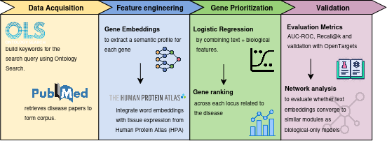
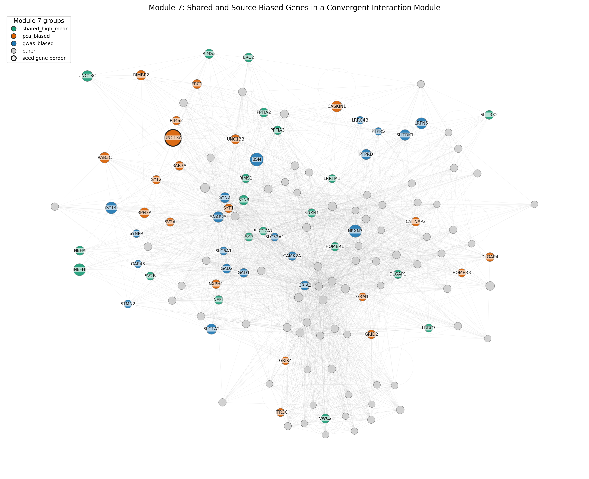

  

## 🧬 Gene Prioritization with Word Embeddings and Protein Networks

📅 **Research Period:** Jul 2025 – Jul 2026

🌐 **GitHub:** [Gene discovery](https://github.com/jpviguini/als-genes)  

**This research is supported by a FAPESP undergraduate fellowship** ([grant link](https://bv.fapesp.br/en/bolsas/228539/temporal-prediction-of-genetic-associations-in-als-through-nlp-and-complex-network-analysis/)).  

### Overview

Amyotrophic Lateral Sclerosis (ALS) is a fatal and highly heterogeneous neurodegenerative disease with multiple genetic and molecular contributors. Although GWAS and sequencing studies have identified important ALS-associated loci and genes, translating these signals into clear causal gene hypotheses remains a major challenge.

This project investigates whether biomedical literature embeddings can provide functional context for ALS gene prioritization. Instead of treating text-derived representations as standalone predictors, the project combines them with tissue-expression features from the Human Protein Atlas (HPA) and compares the resulting functional signal with GWAS-derived evidence.

The main finding is that literature-derived embeddings did not consistently improve locus-level gene ranking, but the Word2Vec embedding space showed biologically interpretable structure. In protein network analyses, the Word2Vec/HPA model converged with GWAS-derived evidence at the level of protein interaction modules, suggesting that text-derived representations may be most useful for systems-level biological interpretation.

---

### Method at a Glance

<!-- Ajuste o tamanho mudando width -->

  

At a high level, the workflow consists of five stages:

- **Literature collection:** We construct disease-focused PubMed corpora for neurodegenerative and motor neuron disease contexts using ontology-guided search terms.
- **Gene representation:** Each gene is represented using literature-derived embeddings, with **Word2Vec** used as the main interpretable embedding model and PubMedBERT explored as a complementary contextual representation.
- **Feature integration:** Gene embeddings are reduced with PCA and combined with **HPA brain and muscle expression** features to build a functional gene-prioritization model.
- **Locus-level evaluation:** Logistic-regression models are evaluated on ALS-associated GWAS loci to test whether text-derived features improve candidate-gene ranking.
- **Network interpretation:** Functional scores from the Word2Vec/HPA model are compared with GWAS-derived evidence through protein-network propagation, module enrichment, and Gene Ontology analysis.

  

---
